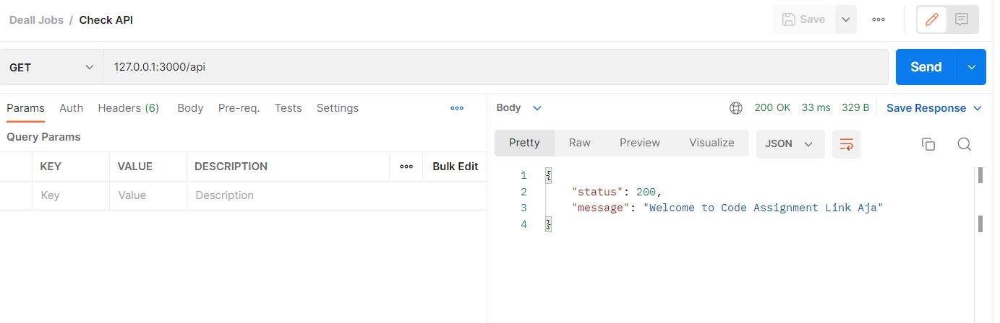

#### DENANDA HENDRA PRATAMA

#### denanda.hendra.p@mail.ugm.ac.id

## Users

A simple rest api used to CRUD Users.

### How to run the apps :

#### 1. Create new file `docker-compose.yml` and fill with this code
```
version: '3.8'
services:
    postgres:
        image: postgres:13
        container_name: postgres
        environment:
          POSTGRES_PASSWORD: postgres
          POSTGRES_USER: postgres
        volumes:
          - ./sql/pg.sql:/docker-entrypoint-initdb.d/pg.sql
        restart:
          always
        networks:
          - deall-networks
    deall-job:
        image: denandahp/deall-job-test:latest
        container_name: deall-job
        env_file: .env
        environment:
          WAIT_HOSTS: postgres:5432
        networks:
            - deall-networks
        ports:
            - 3000:3000

networks:
   deall-networks:
```
#### 2. Launch the apps

Build docker compose

```
$ docker-compose up
```

After the apps running is succesfully, we can start by calling routes. For example :

```
127.0.0.1:3000/
```

If you have successfully connected to the server, it will look like this:



### API Guide And Documentation :

All API documentation can be accessed at the following link:

```
https://documenter.getpostman.com/view/9038393/2s8YzUyhZ4
```
